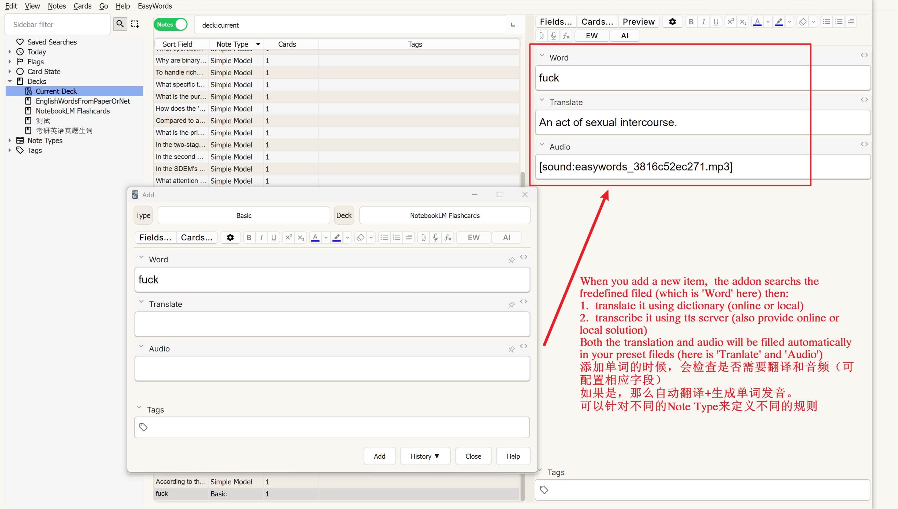
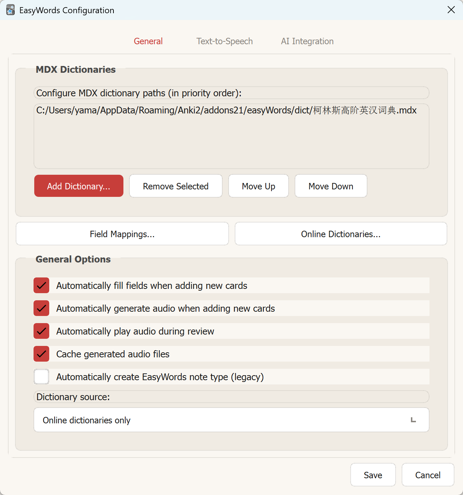

# EasyWords - Vocabulary Builder for Anki

EasyWords is a helpful addon in anki for memorying English words providing experimental **dictionary** and **tts** functions.

EasyWords是丐版的AwsomeTTS+WordQuery，并且提供了自动填写的功能。

## Features

- Auto Fillin Audio and translation (Sadly, only a few solution is provided)
- Smart Fill in (fine-grained configuration)
- Local first

## Overview

It is worth mentioning that above function works well with Anki Connect which provides a restful api for Anki to connect to broswer or other apps.

If you want , you can use my fork of zotero translation plugin to have a smoth experience :

[zotero-translation-with-anki-support
](https://github.com/yama-lei/zotero-pdf-translate)

## Setting options

Open `Tools`->`EasyWOrds Configuration` to open setup menu

### General Setting

#### Dictionary

- To use a local dictionary, you have to download a mdx dict and load it in the configuration menu.
- To use online dictionary, just click 'Online Dictionaries' and select Dictionary source to Online dictionaries.

### TTS

- Edge TTS
- sapi5 tts

### AI Intergration (beta)

- API key
- Model
- Baseurl

Apparently, this feature is useless.

## Contributors
